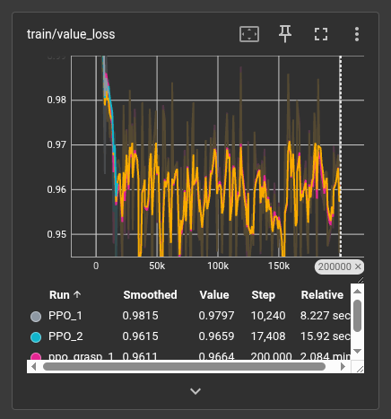
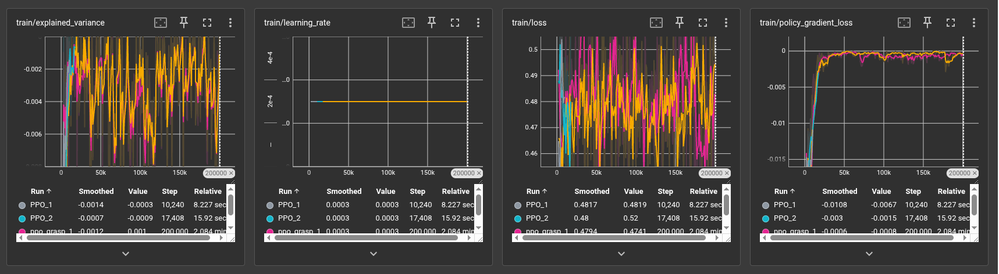
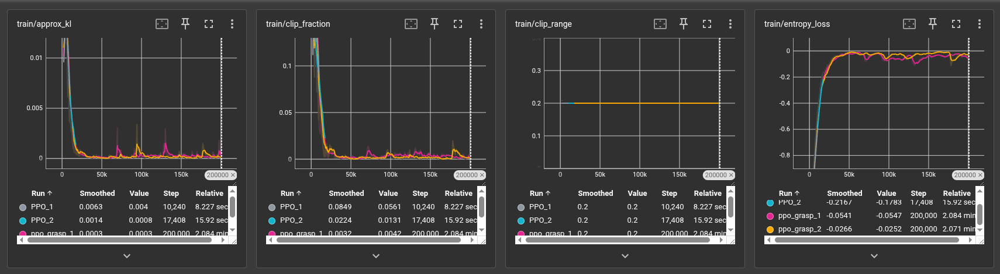
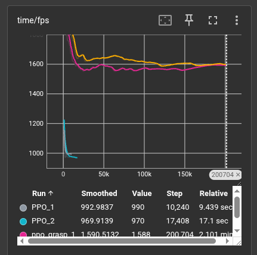
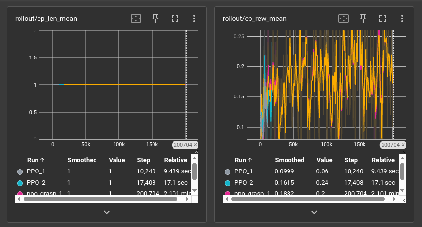
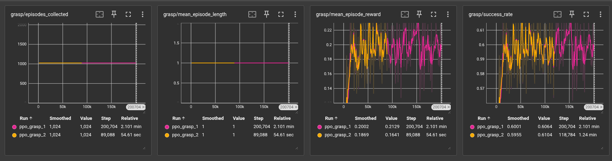
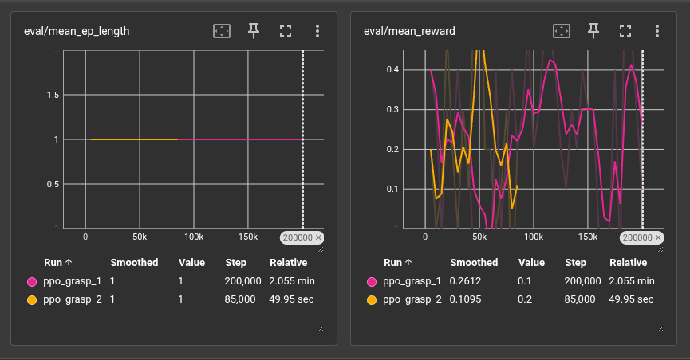

# PPO Grasping Task — TensorBoard Training Analysis

---

## Summary & Key Takeaways

| Observation | Detail |
|-------------|--------|
| Policy gradient and KL stabilise | Normal PPO convergence behaviour |
| ~60% grasp success rate | Solid task performance for a sparse-reward setting |
| `ppo_grasp_2` faster convergence | Reaches similar success rate in ~half the steps |
| Value function not converging | Explained variance near zero throughout |
| High reward variance | No stable upward trend in episode reward |
| Early entropy collapse | Policy may have under-explored early in training |
| Constant LR, no scheduling | Could benefit from decay in later stages |

---

## Metric-by-Metric Analysis

###  `train/value_loss`
The value loss starts high (~0.99) and quickly drops to the ~0.96 range across all runs, stabilising there. The grasp runs plateau around **0.96**, oscillating without further improvement. This suggests the value function is not fitting the returns well — a common symptom of high reward variance or insufficient critic capacity.

---

###  `train/explained_variance`
All runs hover near **zero or slightly negative** (around −0.001 to −0.006) throughout training. Explained variance near zero means the value function predictions are essentially uncorrelated with actual returns. This is a significant concern: a poor value baseline increases gradient variance and can slow or destabilise policy learning.

###  `train/learning_rate`
- `PPO_1` and `PPO_2` use a constant learning rate of **4×10⁻⁴**.
- `ppo_grasp_1` and `ppo_grasp_2` use a lower constant rate of **2×10⁻⁴**.

No learning rate scheduling (decay) is applied. Given the noisy reward landscape, introducing a decay schedule could help fine-tune the policy in later training stages.

###  `train/loss` (Total Loss)
Total loss fluctuates between approximately **0.46–0.50** across all runs, with no strong downward trend. The persistence of high loss amplitude throughout 200k steps suggests the policy is exploring broadly but not consistently improving. This aligns with the noisy reward signal observed in rollout metrics.

###  `train/policy_gradient_loss`
Policy gradient loss starts large and negative (around −0.015) early in training and converges towards **~0** by ~50k steps for all runs. This is typical PPO behaviour — the policy updates become smaller as it stabilises. The grasp runs show a smooth convergence, which is a positive sign that the clipping mechanism is functioning correctly.

---

###  `train/approx_kl`
KL divergence starts elevated (~0.01) and rapidly drops to near **zero** (~0.0003–0.004) after the first few thousand steps. Occasional spikes are visible, particularly in `ppo_grasp_1`. The low steady-state KL confirms that PPO's clipping is keeping policy updates conservative, though the early spikes suggest the initial policy shifts were aggressive.

###  `train/clip_fraction`
Clip fraction begins high (~0.1–0.13) and falls sharply to **near zero** (~0.003–0.008) within the first 25k steps. This mirrors the KL trend, confirming that the policy updates are rarely hitting the clip boundary after the initial phase — the policy has entered a relatively stable update regime.

###  `train/clip_range`
Clip range is fixed at a constant **0.2** across all runs. No adaptive clipping is used. Given the occasional KL spikes, experimenting with a smaller clip range (e.g., 0.1) or adaptive clipping could improve training stability.

###  `train/entropy_loss`
- `PPO_2` (cyan) shows a sharp entropy drop from ~0 to approximately **−0.2**, recovering slightly by step ~17k — consistent with its short run length.
- `ppo_grasp_1` and `ppo_grasp_2` show entropy rising from highly negative values (~−0.8) back towards **~−0.025 to −0.05** over 200k steps.

The entropy increasing from very negative back towards zero over training suggests the policy is initially collapsing (low entropy = deterministic), then recovering some exploratory behaviour. This recovery is healthy but the low entropy early on may have suppressed beneficial exploration.

---

###  `time/fps`
- `PPO_1` and `PPO_2`: ~990–970 FPS (lower throughput).
- `ppo_grasp_1` and `ppo_grasp_2`: ~1,588–1,600 FPS (significantly faster).

The grasp runs achieve roughly **60% higher throughput**, likely due to a different environment configuration (e.g., more parallel workers, vectorised envs). This efficient sampling is important for scaling training.

---

###  `rollout/ep_len_mean`
All runs maintain a constant episode length of **1** throughout training. This indicates episodes are single-step (or terminated immediately after one action), which is consistent with a grasping task formulated as a single-attempt pick scenario.

###  `rollout/ep_rew_mean`
Mean episode reward fluctuates significantly between **~0.10–0.25** for all runs, with no strong upward trend. `PPO_2` achieves a smoothed reward of **0.1615**, slightly better than `PPO_1` at **0.0999**. The grasp run `ppo_grasp_1` shows a smoothed value of **0.1832** by step 200k. The high variance is characteristic of sparse-reward grasping tasks.

---

###  `grasp/` Metrics (Grasp-Specific)

| Metric | `ppo_grasp_1` | `ppo_grasp_2` |
|--------|---------------|---------------|
| Episodes collected | 1,024/step | 1,024/step |
| Mean episode length | 1 | 1 |
| Mean episode reward | 0.2002 (smoothed) | 0.1869 (smoothed) |
| Success rate | 0.6001 (smoothed) | 0.5955 (smoothed) |

Both grasp runs achieve a **success rate of ~60%**, which is a reasonable result for a grasping task. `ppo_grasp_1` slightly outperforms `ppo_grasp_2` on both reward and success rate, though the difference is marginal. Notably, `ppo_grasp_2` reaches comparable performance in only ~89k steps versus 200k for `ppo_grasp_1`, suggesting it may converge faster.

---

###  `eval/` Metrics

| Metric | `ppo_grasp_1` (200k steps) | `ppo_grasp_2` (85k steps) |
|--------|---------------------------|--------------------------|
| Mean episode length | 1 | 1 |
| Mean reward (smoothed) | 0.2612 | 0.1095 |

---

`ppo_grasp_1` achieves a higher eval mean reward of **0.26** at 200k steps. However, the eval reward for both runs is noisy and non-monotonic, suggesting instability or high variance in the evaluation environment. `ppo_grasp_2`'s lower eval reward may simply reflect its earlier stopping point.

